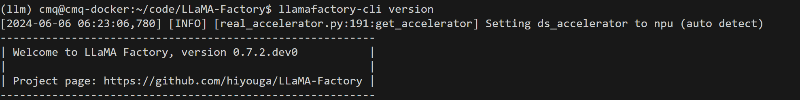
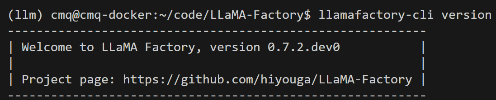

LLAMA-Factory × 昇腾 安装指南
===========================

本教程面向使用 LLAMA-Factory & 昇腾的开发者，帮助完成昇腾环境下 LLaMA-Factory 的安装。

.. - [LLAMA-Factory × 昇腾 安装指南](#llama-factory--昇腾-安装指南)
..   - [昇腾环境安装](#昇腾环境安装)
..   - [LLaMA-Factory 安装](#llama-factory-安装)
..     - [最简安装](#最简安装)
..     - [推荐安装](#推荐安装)
..     - [安装校验](#安装校验)

昇腾环境安装
------------

请根据已有昇腾产品型号及CPU架构等按照 `快速安装昇腾环境指引 <https://ascend.github.io/docs/sources/ascend/quick_install.html>`_ 进行昇腾环境安装，或使用已安装好昇腾环境及 LLaMA-Factory 的 docker 镜像：

- `[32GB]LLaMA-Factory-Cann8-Python3.10-Pytorch2.2.0 <http://mirrors.cn-central-221.ovaijisuan.com/detail/130.html>`_

- `[64GB]LLaMA-Factory-Cann8-Python3.10-Pytorch2.2.0 <http://mirrors.cn-central-221.ovaijisuan.com/detail/131.html>`_

LLaMA-Factory 下载安装
----------------------

.. note::
  如果你已经选择使用上述 docker 镜像，可忽略此步骤，直接开始 LLaMA-Factory 探索之旅。

准备好昇腾环境后，下面即可安装 LLaMA-Factory。推荐使用 conda 创建和管理 Python 虚拟环境，有关 conda 的使用方法不在本教程范围内，此处仅给出用到的指令，如有需要可到 [conda 用户指南](https://conda.io/projects/conda/en/latest/user-guide/tasks/manage-environments.html)中详细查阅。

.. code-block:: shell
    :linenos:
    # 创建 python 3.10 的虚拟环境
    conda create -n <your_env_name> python=3.10
    # 激活虚拟环境
    conda activate <your_env_name>

LLaMA-Factory 下载
~~~~~~~~~~~~~~~~~~~

从  `LLaMA-Factory github 官方仓库 <https://github.com/hiyouga/LLaMA-Factory>`_ 手动下载，或使用 git 拉取最新的 LLaMA-Factory 库：

.. code-block:: shell
    :linenos:
    git clone git@github.com:hiyouga/LLaMA-Factory.git

最简安装
~~~~~~~~~~~~~~~~~~~

完成 conda 虚拟环境的激活后，使用以下命令安装带有 torch-npu 的 LLaMA-Factory：

.. code-block:: shell
    :linenos:
    pip install -e .[torch_npu,metrics]

推荐安装
~~~~~~~~~~~~~~~~~~~

推荐使用 deepspeed 、modelscope 功能，可在 ``[]`` 中继续添加依赖项安装，如:

.. code-block:: shell
    :linenos:
    pip install -e .[torch_npu,metrics,deepspeed,modelscope]

根据 LLaMA-Factory 官方指引，现已支持的可选额外依赖项包括：

> 可选的额外依赖项：torch、torch_npu、metrics、deepspeed、bitsandbytes、vllm、galore、badam、gptq、awq、aqlm、qwen、modelscope、quality

可根据需要进行选择安装。

安装完成后出现 ``Successfully installed xxx xxx ...`` 关键回显信息即说明各依赖包安装成功，如遇依赖包版本冲突，可使用 ``pip install --no-deps -e .`` 安装。

### 安装校验

在[LLaMA-Factory 安装](#LLaMA-Factory 安装)中搭建好的 conda 虚拟环境下，使用 ``llamafactory-cli version`` 指令对 LLaMA-Factory × 昇腾的安装进行校验，如下图所示，正确显示 LLaMA-Factory 版本号说明 LLaMA-Factory 安装成功；显示 `Setting ds_accelerator to npu` 说明 deepspeed 及 npu 环境安装成功。

.. note::
    如果采用最简安装，未安装 deepspeed，则回显如下图：

请愉快使用 LLaMA-Factory × 昇腾实现大语言模型微调、推理吧！
