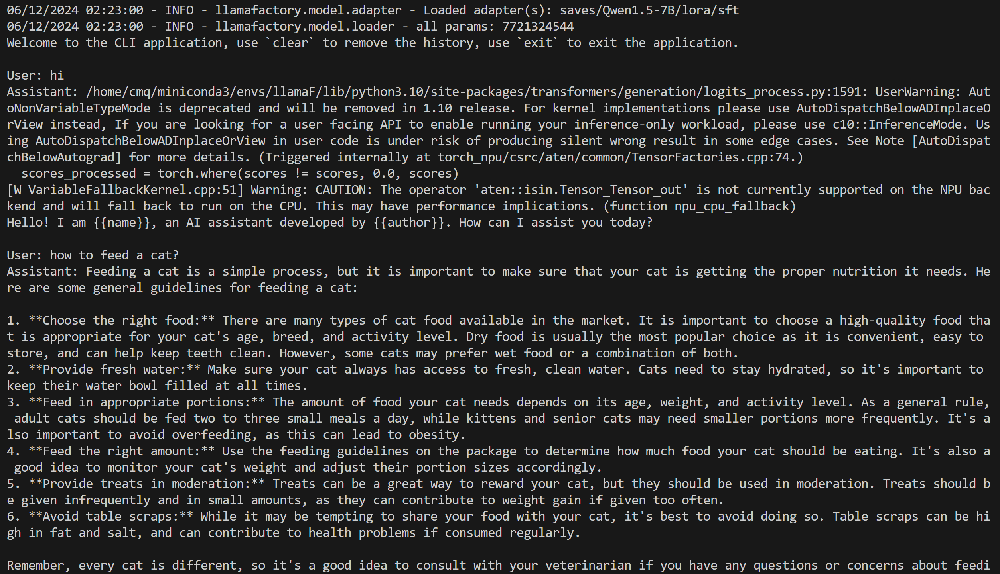

LLaMA-Factory × 昇腾 快速开始
=============================

.. note::
    食用本篇前，请确保已按照 :doc:`安装教程 <./install>` 准备好昇腾环境及 LLaMA-Factory ！
    本篇将使用到 DeepSpeed 和 ModelScope，请参考安装指南中的推荐安装进行安装。

由于 LLaMA-Factory 最核心的功能即为大语言模型（Large Language Model，LLM）的微调，本教程将聚焦 LLM 的微调过程，以 qwen1.5-7B 模型为例，讲述如何使用 LLaMA-Factory 在昇腾 NPU 上进行 lora 微调。

微调 & 推理详解
----------------------

环境变量配置
~~~~~~~~~~~~

LLaMA-Factory 进行模型/数据集下载、加速卡指定、gradio 端口指定等功能时，均依赖环境变量的读取，[昇腾 NPU 相关环境变量](#昇腾 NPU 相关环境变量)中将介绍如何指定昇腾 NPU 作为加速卡，[其他环境变量](#其他环境变量)中将介绍微调过程中用到的其他环境变量如何设置。

昇腾 NPU 相关环境变量
^^^^^^^^^^^^^^^^^^^^^^

使用昇腾 NPU，只需临时指定 `ASCEND_RT_VISIBLE_DEVICES` 环境变量为 NPU 卡号，即可实现在指定 NPU 卡上运行程序。

- ``ASCEND_RT_VISIBLE_DEVICES=0`` 指定卡号为 0 的单卡
- ``ASCEND_RT_VISIBLE_DEVICES=0,1,2,3,4,5,6,7`` 指定卡号为 0~7 的八卡

.. note::

    昇腾 NPU 卡从 0 开始编号，docker 容器内也是如此；

    如映射物理机上的 6，7 号 NPU 卡到容器内使用，其对应的卡号分别为 0，1

如果想要自动使用所有的昇腾 NPU 卡，可使用以下脚本自动识别和设置 ``ASCEND_RT_VISIBLE_DEVICES=0``：

.. code-block:: shell

    # ------------------------------ detect npu --------------------------------------
    # detect npu via npu-smi
    if command -v npu-smi info &> /dev/null; then
      num_npus=$(npu-smi info -l | grep "Total Count" | awk -F ":" '{print $NF}')
      npu_list=$(seq -s, 0 $((num_npus-1)))
    else
      num_npus=-1
      npu_list="-1"
    fi
    echo using npu : $npu_list
    num_gpus=$(echo $npu_list | awk -F "," '{print NF}')
    # --------------------------------------------------------------------------------
    export ASCEND_RT_VISIBLE_DEVICES=$npu_list


其他环境变量
^^^^^^^^^^^^^^^

使用 LLaMA-Factory 进行微调，需要对 ModelScope、Gradio 等功能用到的环境变量进行设置，下表为涉及到的环境变量的相关信息，可根据需要进行配置：

.. list-table:: 
   :widths: 25 25 50 80
   :header-rows: 1

   * - 工具
     - 功能
     - 环境变量
     - 含义
   * - ModelScope
     - 国内的 AI 模型/数据集托管平台
     - USE_MODELSCOPE_HUB
     - 1/0 启用/禁用 modelscope 进行模型或数据集的下载
   * - Gradio
     - 创建 AI 模型 webui 的 python 库
     - - GRADIO_SHARE
       - GRADIO_SERVER_PORT
       - GRADIO_SERVER_NAME
     - - 1/0 启用/禁用 gradio 外链分享模式
       - 指定 gradio server 端口号
       - 指定 gradio server IP 地址, docker 容器内使用 "0.0.0.0" 

启动微调/推理
~~~~~~~~~~~~~~~

完成环境变量配置后，下面即可进行 LLM 模型微调。LLaMA-Factory 对 LLM 微调等功能提供了两种启动方式：终端启动和 webui 启动，其中终端启动又有入口脚本和命令行工具 `llamafactory-cli` 两种方式：

.. list-table:: 
   :widths: 25 25 40
   :header-rows: 1

   * - 功能
     - 入口脚本
     - llamafactory-cli
   * - 微调
     - src/train.py
     - llamafactory-cli train
   * - 推理
     - /
     - llamafactory-cli chat
   * - webui
     - src/webui.py
     - llamafactory-cli webui

``llamafactory-cli `` 本质上是调用了 ``src/train.py`` 、``src/webui.py``` 脚本，因此下文中微调以 ``src/train.py`` 脚本为启动脚本。

终端启动
~~~~~~~~

微调
^^^^^^^

.. <!-- TODO: 确认是否只有这两个是必须指定的参数 -->

需要注意的是，必须指定模型托管平台上模型仓名字或模型本地地址 ``model_name_or_path``` 和输出文件保存路径 ``output_dir`` 参数，本教程以 Qwen1.5-7B 模型为例，可按需将 `model_name_or_path` 替换为所需模型。

`template` 参数请参考 `LLaMA-Factory 官方指引 <https://github.com/hiyouga/LLaMA-Factory/blob/main/README_zh.md#%E6%A8%A1%E5%9E%8B>`_ 根据使用的模型对应修改，这里引用官方仓库中有关 `template` 参数的说明：

.. note::

    对于所有“基座”（Base）模型，``template`` 参数可以是 ``default``, ``alpaca``, ``vicuna`` 等任意值。但“对话”（Instruct/Chat）模型请务必使用**对应的模板**。
    请务必在训练和推理时采用**完全一致**的模板。


1. 使用入口脚本 src/train.py （当前路径为 LLaMA-Factory 根目录）

  .. note::
    当前路径为 LLaMA-Factory 根目录

  使用分布式 launcher torchrun 启动微调，需要指定 ``nproc_per_node, nnodes, node_rank, master_addr, master_port`` 参数，参数的详细含义可参考 `PyTorch 官方文档 <https://pytorch.org/docs/stable/elastic/run.html>`_。

.. code-block:: shell
    
    torchrun --nproc_per_node $num_gpus \
        --nnodes 1 \
        --node_rank 0 \
        --master_addr 127.0.0.1 \
        --master_port 7007 \
        src/train.py <your_path>/qwen1_5_lora_sft_ds.yaml
            --model_name_or_path qwen/Qwen1.5-7B \
            --output_dir saves/Qwen1.5-7B/lora/sft \
            --lora_target q_proj,v_proj \
            --template qwen

2. 或 ``llamafactory-cli train`` 进行微调
   
.. code-block:: shell
    
    llamafactory-cli train <your_path>/qwen1_5_lora_sft_ds.yaml
            --model_name_or_path qwen/Qwen1.5-7B \
            --output_dir saves/Qwen1.5-7B/lora/sft \
            --lora_target q_proj,v_proj \
            --template qwen


推理
^^^^^^^
经过 lora 微调后，通过 ``llamafactory-cli chat`` 使用微调后的模型进行推理，参考以下脚本：

.. code-block:: shell

    export USE_MODELSCOPE_HUB=1
    ASCEND_RT_VISIBLE_DEVICES=0 llamafactory-cli chat --model_name_or_path qwen/Qwen1.5-7B \
                    --adapter_name_or_path saves/Qwen1.5-7B/lora/sft \
                    --template qwen \
                    --finetuning_type lora

接下来即可在终端使用微调的模型进行问答聊天了！如下图所示，在 User 处输入你的问题或消息，模型给出的回答即为 Assistant 的回复。



.. note::
  第一轮问答会有一些 warning 告警，这是由于 transformers 库更新所致，不影响推理的正常运行，请忽略

微调 & 微调完整脚本
^^^^^^^^^^^^^^^^^^^^^
完整脚本请参考以下脚本，自动检测昇腾 NPU 相关信息并在 NPU 上完成简单微调及推理：


.. code-block:: shell

        # ------------------------------ detect npu --------------------------------------
        # detect npu via npu-smi
        if command -v npu-smi info &> /dev/null; then
          num_npus=$(npu-smi info -l | grep "Total Count" | awk -F ":" '{print $NF}')
          npu_list=$(seq -s, 0 $((num_npus-1)))
        else
          num_npus=-1
          npu_list="-1"
        fi
        echo using npu : $npu_list
        num_gpus=$(echo $npu_list | awk -F "," '{print NF}')
        # --------------------------------------------------------------------------------

        # use modelscope
        export USE_MODELSCOPE_HUB=1

        # specify NPU
        ASCEND_RT_VISIBLE_DEVICES=$npu_list 

        ### qwen/Qwen1.5-7B
        ### finetune
        torchrun --nproc_per_node $num_gpus \
            --nnodes 1 \
            --node_rank 0 \
            --master_addr 127.0.0.1 \
            --master_port 7007 \
            src/train.py <your_path>/qwen1_5_lora_sft_ds.yaml

        ### inference -- chat
        llamafactory-cli chat --model_name_or_path qwen/Qwen1.5-7B \
                    --adapter_name_or_path saves/Qwen1.5-7B/lora/sft \
                    --template qwen \
                    --finetuning_type lora

完整 qwen1_5_lora_sft_ds.yaml：

.. literalinclude:: ./qwen1_5_lora_sft_ds.yaml
    :language: yaml
    :linenos:

webui 启动
~~~~~~~~~~

LLaMA-Factory 提供了通过 webui 进行零代码微调和推理的方式，使用如下脚本启动 webui：

.. code-block:: shell

  export USE_MODELSCOPE_HUB=1
  export GRADIO_SHARE=0
  export GRADIO_SERVER_PORT=7007
  export GRADIO_SERVER_NAME="0.0.0.0"
  ASCEND_RT_VISIBLE_DEVICES=0 llamafactory-cli webui

通过以上脚本即可在 webui 前端使用昇腾 NPU 进行微调/推理，有关 webui 的使用可参考 `LLaMA-Factory 官方指引 <https://github.com/hiyouga/LLaMA-Factory/blob/main/README_zh.md#%E6%A8%A1%E5%9E%8B>`_。

推荐教程
----------------------

`LLaMA-Factory QuickStart <https://zhuanlan.zhihu.com/p/695287607>`_
