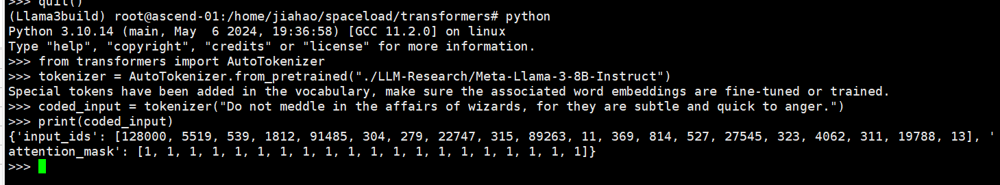
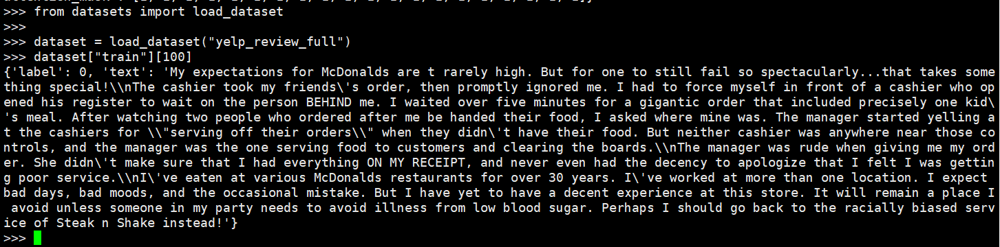
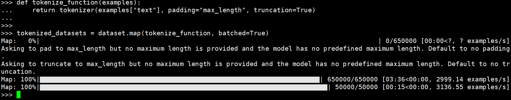
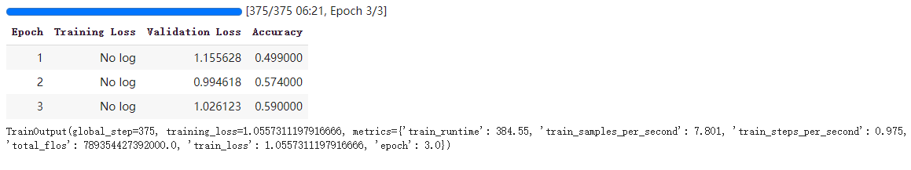

预训练和模型微调
==================

tokenizer
-----------------
根据规则将文本拆分为标记， 并转换为张量作为模型输入

.. code-block:: python
    :linenos:

    from transformers import AutoTokenizer

    tokenizer = AutoTokenizer.from_pretrained("path/to/model")
    encoded_input = tokenizer("Do not meddle in the affairs of wizards, for they are subtle and quick to anger.")
    print(encoded_input)

效果如下:

数据集
----------------

模型训练需要数据集, 这里以 `Yelp Reviews dataset <https://huggingface.co/datasets/Yelp/yelp_review_full>`_ 为例

.. code-block:: python
    :linenos:

    from datasets import load_dataset

    dataset = load_dataset("yelp_review_full")
    dataset["train"][100]

接着便是使用dataset.map方法对数据集进行预处理

.. code-block:: python
    :linenos:

    def tokenize_function(examples):
        return tokenizer(examples["text"], padding="max_length", truncation=True)

    tokenized_datasets = dataset.map(tokenize_function, batched=True)

训练
------------

加载模型
<<<<<<<<<

.. code-block:: python
    :linenos:

    from transformers import AutoModelForCausalLM

    model = AutoModelForCausalLM.from_pretrained("path/to/model")

训练超参数及评估
<<<<<<<<<<<<<<<<<<<<<

TrainingArguments类包含可以调整的所有超参数以及用于激活不同训练选项的标志, 这里使用默认训练超参数

.. code-block:: python
    :linenos:

    import numpy as np
    import evaluate
    from transformers import TrainingArguments, Trainer

    metric = evaluate.load("accuracy")

    def compute_metrics(eval_pred):
        logits, labels = eval_pred
        predictions = np.argmax(logits, axis=-1)
        return metric.compute(predictions=predictions, references=labels)

    training_args = TrainingArguments(output_dir="test_trainer", eval_strategy="epoch")

Trainer
<<<<<<<

使用已加载的模型、训练参数、训练和测试数据集以及评估函数创建一个Trainer对象, 并调用train()来微调模型

.. code-block:: python
    :linenos:
    
    trainer = Trainer(
        model=model,
        args=training_args,
        train_dataset=small_train_dataset,
        eval_dataset=small_eval_dataset,
        compute_metrics=compute_metrics,
    )

    trainer.train()

至此, 便可完成简单的模型微调