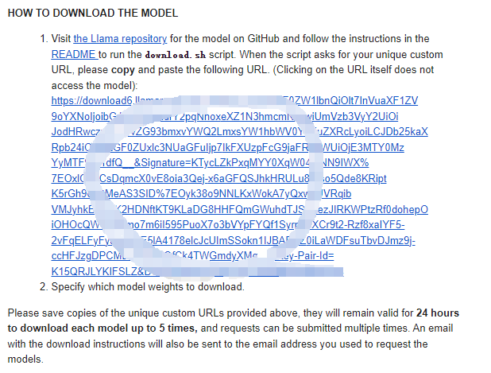

安装指南
===========

本文将介绍如何在昇腾环境下使用transfomers安装和使用Llama3, 关于昇腾环境搭建方面, 请参考 `快速安装昇腾环境 <../ascend/quick_install.html>`_。

模型获取
-------------

模型获取目前提供三种方式, Meta官方_, Huggingface_, ModelScope_, 其中前两种需要提供信息获取license, ModelScope则可以直接进行下载

Meta官方
<<<<<<<<<<<<<<<<
下载模型前需要获取licence, 前往 `Meta官网 <https://llama.meta.com/llama-downloads>`_ , 提供信息获取到许可证, 拿到已签名的URL
之后进行源码的获取，访问 `官方Github地址 <https://github.com/meta-llama/llama3>`_ 进行下载

运行脚本

.. code-block:: python
    :linenos:

    ./download.sh

运行时输入邮件中收到的URL,即可进行模型的下载

Huggingface
<<<<<<<<<<<<<<<
hugging face同样需要获得licence, 访问其中一个仓库, 例如meta-llama/Meta-Llama-3-8B-Instruct. 接受许可后等待请求获得批准即可

获得许可后, 有两种下载方式
 - 点击下载原始文件夹, 或者通过pip安装

 - 使用transformers, 如下

   .. code-block:: python
        :linenos:

        import transformers
        import torch
        import torch_npu
        device = torch.device("npu:0" if torch.npu.isavailable() else "cpu")
        model_id = "meta-llama/Meta-Llama-3-8B-Instruct"
        pipeline = transformers.pipeline(
        "text-generation",
        model="meta-llama/Meta-Llama-3-8B-Instruct",
        model_kwargs={"torch_dtype": torch.bfloat16},
        device="auto",
        )

ModelScope
<<<<<<<<<<<

ModelScope则可以直接进行下载, 如果安装了modelscope包, 可以安装下面方法下载模型

.. code-block:: python 
    :linenos:

    import torch
    from modelscope import snapshot_download, AutoModel, AutoTokenizer
    import os
    
    model_dir = snapshot_download('LLM-Research/Meta-Llama-3-8B-Instruct', cache_dir='/root/autodl-tmp', revision='master')

通过以上方法获取到模型后, 便可以进行模型的 `微调 <./fine-tune.html>`_ 和 `使用 <./inference.html>`_ 

