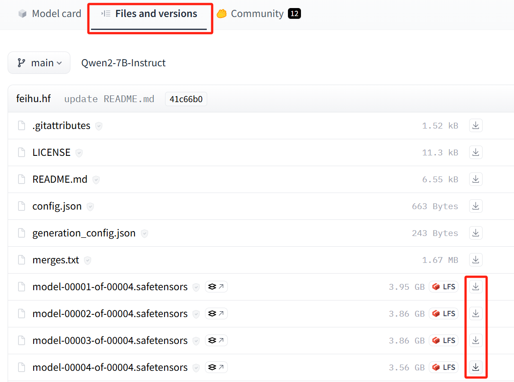

模型获取
==============

本文以Meta-Llama-3-8B-Instruct模型为例，介绍如何进行模型的获取，
该模型获取目前主要有三种方式，Meta官方_，Huggingface_，hf-mirror_， 下面将详细说明这三种获取模型的方法

Meta官方
-----------------

下载模型前需要获取licence，前往 `Meta官网 <https://llama.meta.com/llama-downloads>`_，提供信息获取到许可证，拿到已签名的URL

- 链接类似于下面

.. code-block:: shell 
    :linenos:

    https://download6.llamameta.net/*?Policy=eyJTdGF0ZW1lbnQiOlt7InVuaXF1ZV9oYXNoIjoibGJuYXc0bzdrY2pqNnoxeXZ1N3hmcmNvIiwiUmVzb3VyY2UiOiJodHRwczp
    cL1wvZG93bmxvYWQ2LmxsYW1hbWV0YS5uZXRcLyoiLCJDb25kaXRpb24iOnsiRGF0ZUxlc3NUaGFuIjp7IkFXUzpFcG9jaFRpbWUiOjE3MTY0MzYyMTF9fX1dfQ__&Signature=KTyc
    LZkPxqMYY0XqW047tNN9IWX%7EOxlQbqCsDqmcX0vE8oia3Qej-x6aGFQSJhkHRULu8Efso5Qde8KRiptK5rGh9oLrtMeAS3SID%7EOyk38o9NNLKxWokA7yQxwvUVRqibVMJyhkE8XE
    K2HDNftKT9KLaDG8HHFQmGWuhdTJSvCezJIRKWPtzRf0dohepOiOHOcQW%7Ermo7m6iI595PuoX7o3bVYpFYQf1Syrp05XCr9t2-Rzf8xaIYF5-2vFqELFyFyJys%7E5lA4178elcJcU
    ImSSokn1IJBARAZ0iLaWDFsuTbvDJmz9j-ccHFJzgDPCMLQjHpK6QfCk4TWGmdyXMg__&Key-Pair-Id=K15QRJLYKIFSLZ&Download-Request-ID=1502880093958574

- 之后进行源码的获取，使用以下命令进行下载并进入到工作目录

.. code-block:: shell 
    :linenos:

    git clone https://github.com/meta-llama/llama3.git
    cd llama3

- 运行脚本

.. code-block:: python
    :linenos:

    ./download.sh

运行时输入上边获取到的URL，即可进行模型的下载

Huggingface
--------------------
hugging face同样需要获得licence，访问其中一个仓库，
 `meta-llama/Meta-Llama-3-8B-Instruct <https://huggingface.co/meta-llama/Meta-Llama-3-8B-Instruct>`_ ，接受许可后等待请求获得批准即可

得到权限后，点击"文件和版本"标签，下载原始文件夹的内容或通过以下命令行下载

.. _[one]:

- 安装huggingface-hub 

.. code-block:: shell

    pip install huggingface-hub

- 下载文件

.. code-block:: shell

    huggingface-cli download meta-llama/Meta-Llama-3-8B-Instruct --include “original/*” --local-dir meta-llama/Meta-Llama-3-8B-Instruct

以上两种方法国内用户可能无法完成，下面推荐 **国内用户** 的获取模型的方式

hf-mirror
-------------------

国内用户主要获取模型的方式是hf-mirror，它是huggingface平台的镜像网站， 提供了一个备用的域名来访问Huggingface的资源和功能，
以Qwen2-7B-Instruct为例(Meta-Llama-3-8B-Instruct同样需要获取license，不方便国内用户， 这里用Qwen2代替说明)， 共有三种方法，下面依次进行介绍

直接下载
<<<<<<<<<<<<<<<

点击模型的下的 **↓** 图标进行文件下载，如下

修改镜像源
<<<<<<<<<<<<<<<<<<

- 修改环境变量HF_ENDPOINT,该变量会替换huggingface.co域名

.. code-block:: shell
    :linenos:

    # 临时生效    
    export HF_ENDPOINT=https://hf-mirror.com    
    # 永久生效    
    echo export HF_ENDPOINT=https://hf-mirror.com >> ~/.bashrc 

- 使用huggingface_hub从镜像仓库直接下载
- :ref:`安装huggingface-hub <[one]>`

.. code-block:: python
    :linenos:

    # huggingface_hub下载单个文件 
    from huggingface_hub import hf_hub_download 
    hf_hub_download(repo_id="Qwen/Qwen2-7B-Instruct", filename="config.json", cache_dir="./your/path/Qwen")
    
    # huggingface_hub下载整个项目 
    from huggingface_hub import snapshot_download    
    snapshot_download(repo_id="Qwen/Qwen2-7B-Instruct", cache_dir="./your/path/Qwen")

git lfs
<<<<<<<<<<<<<<<<<<<

使用以下命令clone模型

.. code-block:: shell
    :linenos:

    # Make sure you have git-lfs installed (https://git-lfs.com)
    git lfs install

    git clone https://hf-mirror.com/Qwen/Qwen2-7B-Instruct

    # If you want to clone without large files - just their pointers
    # GIT_LFS_SKIP_SMUDGE=1 git clone https://hf-mirror.com/Qwen/Qwen2-7B-Instruct

以上任意一种即可完成模型的获取，保存在本地路径后可以进行 `微调预训练模型 <./fine-tune.html>`_ 和 `推理 <./inference.html>`_ 等操作